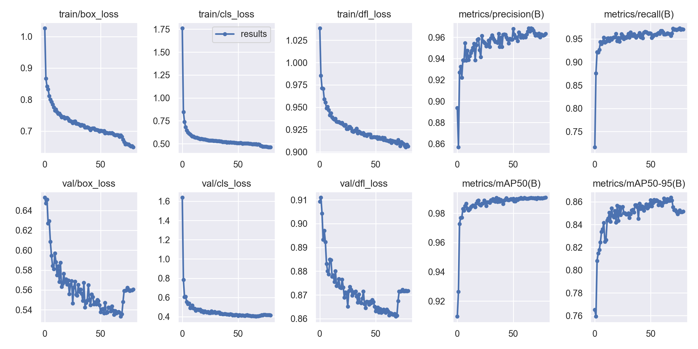
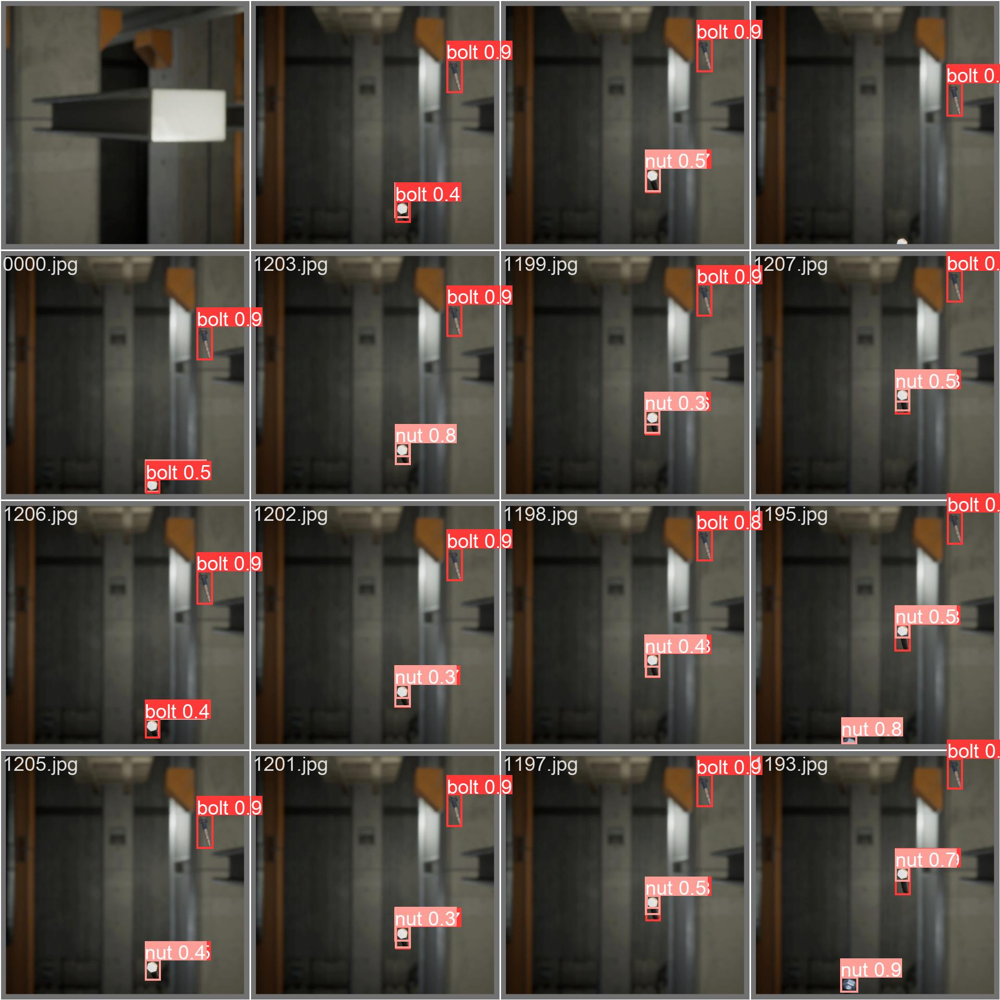

# Stroma Challenge
This repo is created as a response to [Stroma challenge](https://stromavision.notion.site/Stroma-Machine-Learning-Engineer-Technical-Interview-19f4573982b64791b14121faddb2f176).

Challange summary: 
>We are building a computer vision pipeline for a nuts-and-bolts manufacturer. You are expected to use common machine learning frameworks to implement a system to detect, classify and track falling objects. You may use Google Colab to run your experiments. Your final outcome should be able to accurately track different types of nuts and bolts, even under varying lighting conditions, and keep count of them.


# Pipeline 
The object tracking pipeline uses [Yolov8n](https://docs.ultralytics.com/) model for detection. [Ultralytics](https://github.com/ultralytics/ultralytics) provide a framework to train Yolo architectures easily. However I used [different variant of the repo](github.com/theATM/yolov8) with layer freezing capabilities while training. 

The framework provides functionalities for most of the desired qualities on a detection backend model as a product such as [fusing](https://docs.ultralytics.com/reference/nn/?h=fuse#ultralytics.nn.tasks.BaseModel.fuse) of layers for lowering computational needs, [exporting](https://docs.ultralytics.com/cfg/?h=export#export) to formats like ONNX (for edge devices such as jetson), and [data augmentation](https://docs.ultralytics.com/cfg/?h=augme#augmentation) out of the box. 

The object tracking pipeline uses [Simple Online and Realtime Tracking with a Deep Association Metric](https://arxiv.org/abs/1703.07402) algorithm to track objects. The python implementation I used is the [deep-sort-realtime](https://pypi.org/project/deep-sort-realtime/) package.

# Installation 
The pipeline is developed with python 3.9. You will need a python 3.9 interpreter.

First we need to install the traning framework. Then other packages needs to be installed for the pipe line

```
virtualenv st # create environment
git clone https://github.com/ubeydemavus/yolov8detach 
cd yolov8detach && pip install -e .
```

If you have a GPU that supports CUDA, you may want to reinstall torch with CUDA capabilities. Install cuda enabled torch according to the CUDA version installed in your computer. Follow the instructions in [Pytorch](https://pytorch.org/get-started/locally/) to install correct CUDA version.
```
pip install --ignore-installed torch torchvision torchaudio --extra-index-url https://download.pytorch.org/whl/cu116
```

Tracking related libraries 
```
pip install deep-sort-realtime
pip install motmetrics
```

# Transforming the dataset
After the installation, move the [challange folder](https://github.com/Stroma-Vision/machine-learning-challenge/releases/download/v0.1/challenge.zip) into yolov8detach folder. Export the archive and move contents not the archive. Then run the command below. This will transform the video files and annotations of the dataset into a format that the framework expects for training.
```
python coco2yolo.py
```

# Training 
Although you get a copy of the model trained on the nuts and bolts dataset, when you clone this repo. You may start re-training from the pretrained (trained with COCO dataset) Yolov8n model check point. The framework downloads the necessary weights. You may skip this step and move to the next step. The model trained on the nuts and bolts dataset is about 6MB in size with 8 GFlops of computational need and 3.7M parameters.

In order to start training, run the command below. This script, takes a pretrained Yolov8n model, freezes the first 22 blocks/layers except the detection head, then starts training with default augmentation settings, changed optimizer configurations and correct class weights for 80 epochs. When the training is finished, trained model can be found in "runs/" folder with important metrics.

```
python challenge_train.py
```

## The model training metrics on the nuts and bolts dataset

Other metrrics, such as confusion matric, F1 curves etc.. can be found under "runs/detect/train2/"

## Output example of detection from validation batch

Other examples can be found under "runs/detect/train2/"

# Object tracking 
When training is complete (or you skipped to this step), run the command below. This script will launch a window and allow you to see the tracking results in realtime for the "test.mp4" file. 

When the video finishes, the tracking metrics (MOTA, MOTP) are calculated and printed on the command window screen where you run the code. 

```
python track_objects.py
```

Note: If you trained your own model, don't forget to change the line to match your newly trained network weights in the script.

```
...
# Load the model which is trained for bolts and nuts dataset.
detector = YOLO(join(current_dir,"runs/detect/train2/weights/best.pt"))
...
```

# Comments on the results
The detection metrics for the trained model is as follows:

| Metric | Score |
| -------|-------|
| mAP50 (mAP calculated at IOU threshold 0.5) | 0.99069 |
| mAP50-95 (mAP calculated at IOU threshold 0.5 to 0.95) | 0.85146 |
| Precision | 0.96329|
| Recall | 0.97091 |

The tracking metrics for the whole pipeline is as follows:
| Metric | Score |
|--------|-------|
| MOTA | -0.930043 |
| MOTP |  0.594262 |

The detection metrics indicate that object classification accuracy is very high, when the bounding box is correctly placed (IoU areas). 

I even suspect that the detection network might have overfit the dataset, thus I might want to retrain the network with stronger augmentations, to reduce overfitting.

On the other hand, tracking metrics indicate that object tracking accuracy is not good. 

I believe this is because of the default tracking strategy employed by the deepsort package. Most objects that are detected confidently, are tracked very well by the deepsort algorithm. However the tracking IDs given to these detections don't match with the dataset track_ids because even the wrong detections (occulusions or miss firings of yolov8) are given a tracking ID, and the next_id to be given is increased. This has a cascading effect on the IDs given to detected objects. Once an object is missed / or a wrong detection happends, all remaining object ID miss matches the dataset track_id's.

# Further improvement suggestions
The challenge period is short, thus I had to resort to using popular frameworks and architectures in order to complete the challenge in time. However if I had time, here are the areas I would work on to improve the accuracy/success of the  tracking pipeline.

## Dataset
- Make sure to use the correct normalization (and transformations in general) in training, and evaluation. The dataset is syntatic, however yolo and other detection architectures are trained with real images from mostly day light and rarely indoor environments. However bolt and nuts dataset comes from a mostly indoor, day or night time, factory environment. I would first make sure that image attribute distributions (color etc..) match, and if not, calculate necessary transformations from real data. 

- Increasing the data (number of classes, number of items in each class, more moving objects from different perspectives ). With more data, we can be more confident about the trained model. 

## Detection Network
In my research I come across few different detection architectures, but did not realy have time to test them and compare them to eachother. Below are the few models I would test before choosing yolo as the deteciton model. 

- [Single shot detector](https://arxiv.org/pdf/1512.02325.pdf): seem to be more appropriate for video analysis and object tracking since it is more precise compared to yolo, however it has issues with small objects. 
- [Object localization network](https://arxiv.org/abs/2108.06753): This intrigued me the most since it does detection without training on class labels. a "general purpose" detector, so to speak. 
- [Detectron 2](https://detectron2.readthedocs.io/en/latest/tutorials/getting_started.html): Powerfull and highly praised by many people. Thus, I would have liked to test it. 
- [MiDaS](https://arxiv.org/abs/1907.01341): This is a single-image-depth-estimator (again a cross dataset model). I would have liked to experiment with this to improve the accuracy of the pipeline. The information this model provides could be used to improve object tracking via integrating it to deepsort algorithm's tracking strategy.

There are few more (FastRCNN, MaskRCNN, etc..), but I would explore the ones listed above first.

Once I decided on a detection architecture, I would use [Distiller](https://intellabs.github.io/distiller/usage.html) package (or some other library since intel has dropped its support to this library) to [prune](https://intellabs.github.io/distiller/pruning.html), [quantize](https://intellabs.github.io/distiller/quantization.html) and [distill](https://intellabs.github.io/distiller/knowledge_distillation.html) the architecture into a smaller architecture (not necessaryly in this order). Finally I would fuse batchnorm2d and conv2d layers into a single layer.

I would like to note that the Ultralytics framework already does fusing to lessen the computational load. However, after pruning and/or distillation stages, we probably can't use framework's automatic fusing function. Thus we may need to do it manually. 

Finally, export it to ONNX format (or Torch script) to run on any device that supports them to run the network independently from the dependencies.

## Object Tracking
This is where the most work needs to be done. 

- Firstly, the deep-sort-reatime packege implementation of the object tracking algorithm is problematic. 

- The implementation updates Kalman filter covariances with constant uncertainty weights, making this implementation much less powerfull. 

- It doesn't provide a way to set the initial guesses for the filter, either. I found this [repo](https://github.com/GeekAlexis/FastMOT) much later, which seemed to implement kalman filter better, but it was too late to test.

- The package also doesn't provide a low level interface to the Kalman filter implementation thus you can't change sampling time, and//or other variables that affect its estimation/filtering accuracy. Thus, I had to resort to hot-fix workaround in the lines:

```
tracker.__dict__['tracker'].kf.__dict__['_std_weight_position'] = 1  # hot fix position and velocity weights, deepsort doesnt provide an interface to change kalman filter, or its parameters.
tracker.__dict__['tracker'].kf.__dict__['_std_weight_velocity'] = 3  # (trained model measurements is good enough -> kalman model uncertainty should be high).

```

- The paper proposes and uses a constant velocity motion model, however a constant acceleration model would fit the use-case probably better since falling objects accelerate with a constant acceleration. For more info as to why, you can check [here](https://www.kalmanfilter.net/alphabeta.html) (compare the results for g-h filter vs g-h-k filter)

- Also other sensor information can be used (technique known as sensor fusion) to improve the kalman filter even further, such as incorporating the detection confidence into uncertainty calculations, using depth estimation, extracted texture information, maybe using two different detection model's outputs etc.., this requires a lot more work than possible in a week. 

- The deep-sort-realtime package uses mobilenetv3 as the deep embedder, and provides an interface to use custom embedder. I would have liked to try few different models, before deciding on the mobilenetv3.

- Finally, I would change the default tracking strategy employed in deep-sort-realtime. The default strategy is not fit to the use-cases of counting different object types in the presence of faulty detections and when an object is lost for few frames. I would continuously process the tracks with new detections even when they are lost more than few frames (use confidence information here as well), and provide a better way for reidentificaiton (instead of mobilenetv3). Because default strategy doesn't continue counting up if a new detection of a previously detected object enters the scene. The default strategy assumes the new detection to be a previously detected object coming back into the frame rather than a new object entering the frame.


